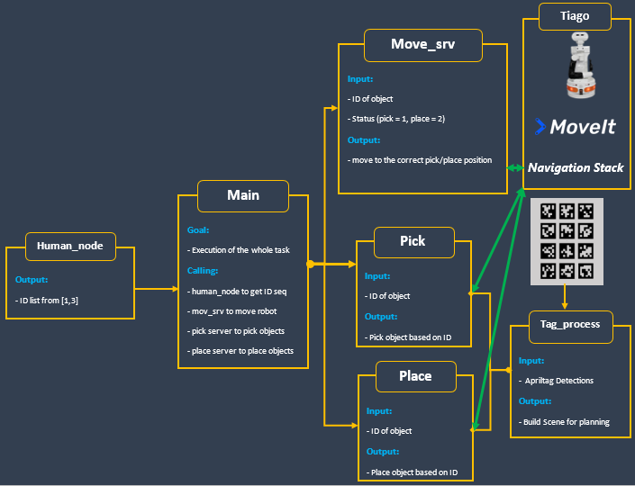

# Goal of the project
The problem that we are addressing is the “**Pick and Place**” of three target objects :
- A blue hexagonal
prism 
- A green triangular prism 
- A red cube  

placed on a table among some yellow hexagonal obstacles each
of those objects have tag that assigns an ID to it. The objective is, after receiving a sequence of ID’s
from *(human node)*, detect and pick objects from a cluttered table, and bring them to a cylindrical table
with the same color. To solve this, routines were implemented on ROS based on **navigation**, **joint and
pose control** for a robotic arm, and **object detection** based on tags.

# Project Architecture 

 

# Setup 

### 1) Install tiago (*melodic version*) 

http://wiki.ros.org/Robots/TIAGo/Tutorials/Installation/InstallUbuntuAndROS
	
### 2) Clone the *tiago_iaslab_simulation* package inside the *tiago_public_ws* 

# Mandatory Tasks

### 1) Building the workspace
	
	$ cd ~/tiago_public_ws
	$ catkin build

### 2) Starting the simulation:

	$ roslaunch tiago_iaslab_simulation start_simulation.launch world_name:=ias_lab_room_full_tables

### 3) Starting the apriltag:

	$ roslaunch tiago_iaslab_simulation apriltag.launch

### 4) Starting the navigation:

	$ roslaunch tiago_iaslab_simulation navigation.launch

### 5) Running the human node:

	$ rosrun tiago_iaslab_simulation human_node

### 6) Configuring paramteres

Go to /config directory inside our package that will depend on where you put the files in your machine
	
	$ cd ~/tiago_public_ws/src/ir2223_group_19/tiago_iaslab_simulation/config
	$ rosparam load param.yaml

### 7) Starting the detection node:
	
Go to /scripts directory inside our package that will depend on where you put the files in your machine

	$ cd ~/tiago_public_ws/src/ir2223_group_19/tiago_iaslab_simulation/scripts
	$ chmod +x *.py
	$ rosrun tiago_iaslab_simulation tags_process.py
or,

	$ python tags_process.py
### Note:
If you encounter this error 

	/usr/bin/env: ‘python\r’: No such file or directory
Do the following inside /scripts directory:
	
	$ sudo apt install dos2unix
	$ dos2unix *.py

### 8) Starting the navigation server:

	$ cd ~/tiago_public_ws/src/ir2223_group_19/tiago_iaslab_simulation/scripts
	$ rosrun tiago_iaslab_simulation move_srv.py
or,

	$ python move_srv.py

### 9) Starting the pick server:

	$ cd ~/tiago_public_ws/src/ir2223_group_19/tiago_iaslab_simulation/scripts
	$ rosrun tiago_iaslab_simulation pick.py
or,

	$ python pick.py

### 10) Starting the place server:

	$ cd ~/tiago_public_ws/src/ir2223_group_19/tiago_iaslab_simulation/scripts
	$ rosrun tiago_iaslab_simulation place.py
or,

	$ python place.py

### 11) Finally, starting the main node:

	$ cd ~/tiago_public_ws/src/ir2223_group_19/tiago_iaslab_simulation/scripts
	$ rosrun tiago_iaslab_simulation main.py
or,

	$ python main.py

# Report and video link

https://drive.google.com/drive/folders/1LiuZGObPPD1PmshwVTLND4qRcyQgVKm6?usp=share_link

